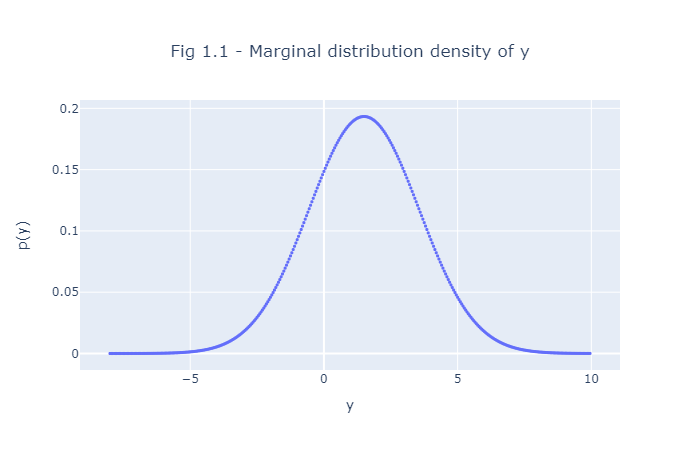

# Exercise 1.1: Conditional probability
Since $p(y \mid \theta=1)= N(y \mid 1, \sigma^2)$ and $p(y \mid \theta=2)=N(y \mid 2, \sigma^2)$, hence:

\begin{equation*}
  p(y \mid \theta=\theta_0) = \begin{cases}
    N(y \mid \theta_0, \sigma^2) & \text{if } \theta_0 \in \{1, 2\}\\
    0 & \text{otherwise}
  \end{cases}
\end{equation*}

(a) Let $\sigma=2$, then:

\begin{equation*}
\begin{split}
p(y) & = \sum\limits_{\theta} p(y,\theta) = \sum\limits_{\theta} p(y \mid \theta)p(\theta)  = \sum\limits_{\theta \in \{1,2\}} N(y \mid \theta, 2^2) \cdot 0.5\\
& = 0.5 \cdot N(y \mid 1, 4) + 0.5 \cdot N(y \mid 2, 4) = 0.5 \cdot N(y\mid 3, 8) = N(y\mid 1.5, 2)
\end{split}
\end{equation*}



(b) By Bayes' theorem and the law of total probabilities:

\begin{equation*} 
\begin{split}
p(\theta=1\mid y=1) & = \frac{p(y=1\mid \theta=1)\cdot p(\theta=1)}{p(y)} = \frac{p(y=1\mid \theta=1)\cdot p(\theta=1)}{p(y=1\mid \theta=1)\cdot p(\theta=1) + p(y=1\mid \theta=2)\cdot p(\theta=2)} \\
& = \frac{0.5 \cdot N(1\mid 1,4)}{0.5 \cdot N(1\mid 1,4) + 0.5 \cdot N(1\mid 2,4)} =  \frac{1}{1 + \exp(-\frac{1}{8})} \approx 0.531
\end{split}
\end{equation*}

(c) Notice that we have the following equalities:

\begin{equation*}
\begin{split}
N(1\mid 1, \sigma) = & \frac{1}{\sigma \sqrt{2\pi}} & \\
N(1\mid 2, \sigma) = & \frac{1}{\sigma \sqrt{2\pi}} \cdot \exp\left(-\frac{1}{2}\cdot \left( \frac{1-2}{\sigma}\right)^2\right) & = \frac{1}{\sigma \sqrt{2\pi}} \cdot \exp\left(-\frac{1}{2\sigma^2}\right)
\end{split}
\end{equation*}

Hence 

\begin{equation*} 
p(\theta=1\mid y=1)  = \frac{1}{1 + \exp\left(-\frac{1}{2\sigma^2}\right)} = 
    \begin{cases}
        1 & \text{for } \sigma\rightarrow 0 \\
        \frac{1}{2} & \text{for } \sigma\rightarrow \infty
  \end{cases}
\end{equation*}

We deduce that for $\sigma\rightarrow 0$ the posterior density of $\theta$ approaches 1 while for $\sigma\rightarrow \infty$ the posterior of $\theta$ approaches its prior.

---

Here's the python code to generate Fig 1.1, the distribution of $p(y)$:
```python
import numpy as np
import scipy.stats as stats
import plotly.graph_objects as go

y = np.arange(-8, 10, 0.05)
py = 0.5 * stats.norm(loc=1, scale=2).pdf(y) + 0.5 * stats.norm(loc=2, scale=2).pdf(y)
fig = go.Figure(
        go.Scatter(x=y, 
                   y=py,
                   mode='markers',
                   marker={'size':3},
                  )
)

fig.update_layout(
    title={'text': 'Fig 1.1 - Marginal distribution density of y',
           'y':0.9, 'x':0.5, 'xanchor': 'center', 'yanchor': 'top'},
    xaxis={'title': 'y'},
    yaxis={'title': 'p(y)'})

fig
```